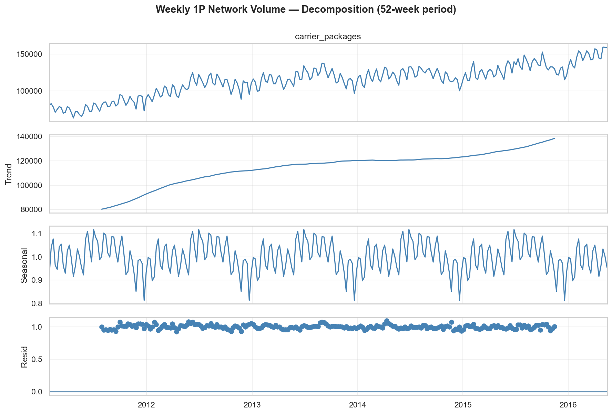
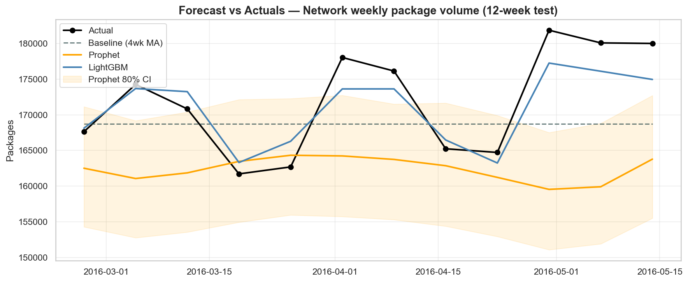
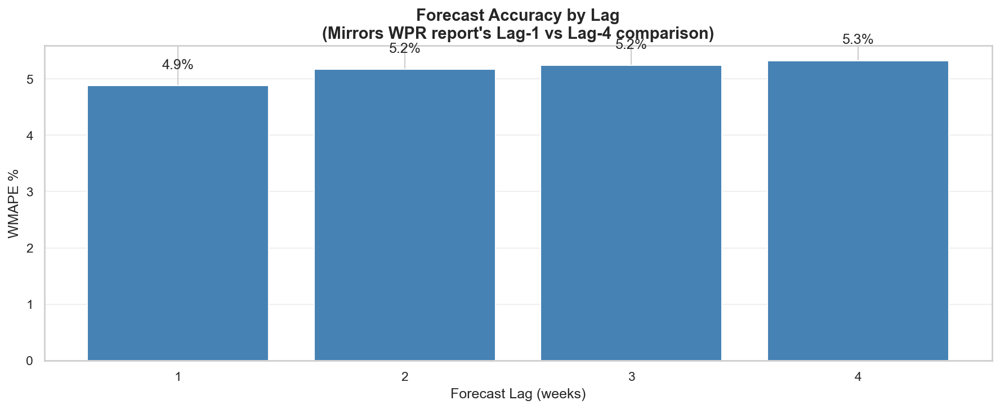
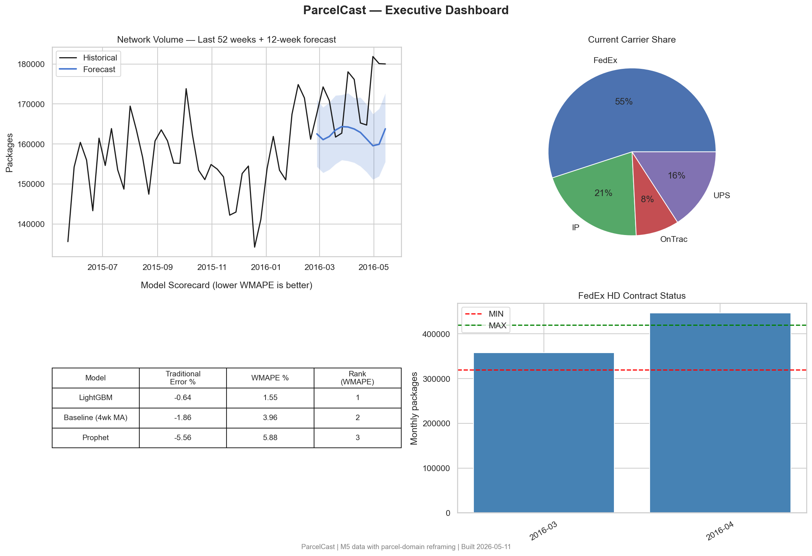

# 📦 ParcelCast — Parcel Volume Forecasting & Carrier Optimization

> End-to-end forecasting project demonstrating data quality rigor, time-series modeling, and business-decision integration — built on the public M5 retail dataset, framed for parcel-volume use cases.

## TL;DR

Public M5 retail dataset, cleaned with the team's metrics (Traditional Error + WMAPE), two models compared (Prophet + LightGBM), and forecasts mapped to FedEx contract compliance and OnTrac tier monitoring.

## Screenshots

**Time series decomposition**



**Forecast vs actuals (12-week test)**



**Lag analysis (matches WPR format)**



**Executive dashboard**



## The Domain Mapping

The project re-frames M5 retail sales data as a parcel-forecasting problem:

| M5 Concept | → ParcelCast Concept |
|---|---|
| Unit Sales | Ordered Units |
| Store (CA_1, TX_2, …) | Fulfillment Center (FC) |
| State (CA, TX, WI) | Shipping Region |
| Category: FOODS, HOUSEHOLD | Channel: 1P (first-party) |
| Category: HOBBIES | Channel: MP (3P Marketplace seller) |
| Units ÷ UPP | Package Volume |
| Calendar Events | Holiday demand spikes |

UPP (Units Per Package) conversion — 1P ≈ 2.1, MP ≈ 1.33 — turns unit forecasts into package forecasts. Package volume is then split across carriers (FedEx ~55%, UPS ~15%, IP ~20%, OnTrac ~10%) with regional variation.

## Notebook Structure

| Notebook | What it does | Why it matters |
|---|---|---|
| **01_data_quality_eda.ipynb** | Load → reshape → join → hierarchy mapping → UPP conversion → carrier splits → weekly aggregation → quality profiling → cleaning audit log → decomposition → stationarity → correlation | Shows data engineering + rigor before modeling |
| **02_modeling.ipynb** | Feature engineering → baseline (4wk MA) → Prophet → LightGBM → Traditional Error + WMAPE → lag analysis table → scorecard | Demonstrates modeling and team-aligned evaluation |
| **03_business_applications.ipynb** | FedEx HD contract monitor → OnTrac Tier 2 risk alert → carrier cost optimizer → executive dashboard | Connects forecasts to actual decisions |

## Key Findings

- **Best model on weekly data:** **LightGBM** at **1.55% WMAPE / −0.64% Traditional Error** — beats the 4-week MA baseline (3.96% WMAPE) by 2.4 pts and Prophet (5.88% WMAPE) by 4.3 pts on the 12-week held-out test.
- **Lag-1 vs Lag-4 accuracy delta:** WMAPE degrades from **4.88% at lag-1 to 5.32% at lag-4** — graceful monotonic decay across all 4 horizons (mirrors WPR reporting format).
- **FedEx HD contract status (next forecasted month):** **ABOVE MAXIMUM** for April 2016 by **~26K packages** — recommended action: pre-shift volume to UPS / IP / OnTrac before month-end.
- **OnTrac Tier 2 risk window:** rolling 6-week avg crossed the Tier 2 threshold (14,500 packages/week) the week of **2016-05-07** — recommend reallocating OnTrac volume to IP or UPS.
- **Cost-shift opportunity (5% FedEx+UPS → IP):** **$14,398/week** in carrier-spend savings = **~$749K/year** at illustrative cost-per-package rates.

## Critical Insight: UPP Drives Package Forecast Error

Package volume = Units ÷ UPP. UPP is itself trending (declining for 1P per WPR). This means **UPP forecast error compounds into package forecast error** — a model that predicts units perfectly but assumes static UPP will systematically over- or under-forecast packages. This is treated as an exogenous feature in the LightGBM model and called out explicitly in the deck.

## Setup

```bash
pip install -r requirements.txt
# Download M5 data from Kaggle into data/
kaggle competitions download -c m5-forecasting-accuracy -p data/
cd data && unzip m5-forecasting-accuracy.zip
cd .. && jupyter lab
```

Run notebooks 01 → 02 → 03 in order. Each saves intermediate artifacts to `data/` and charts to `presentation/`.

## Project Structure

```
parcelcast/
├── README.md
├── requirements.txt
├── data/                            # M5 raw data + intermediate artifacts (gitignored)
├── notebooks/
│   ├── 01_data_quality_eda.ipynb
│   ├── 02_modeling.ipynb
│   └── 03_business_applications.ipynb
├── src/
│   ├── data_loader.py               # M5 load + reshape + hierarchy mapping
│   ├── parcel_transform.py          # UPP conversion + carrier allocation
│   ├── quality.py                   # Profiling, cleaning, audit log
│   ├── features.py                  # Lags + calendar features
│   ├── models.py                    # Baseline / Prophet / LightGBM wrappers
│   ├── evaluation.py                # Traditional Error + WMAPE + lag analysis
│   └── business.py                  # FedEx monitor, OnTrac alert, cost optimizer
├── presentation/                    # Saved charts for the deck
└── SATURDAY_PLAN.md                 # Hour-by-hour playbook
```

## Tech

Python · pandas · LightGBM · Prophet · statsmodels · plotly · matplotlib

## Caveats

This is a weekend portfolio project. Carrier shares, UPP ratios, and cost-per-package figures are **illustrative assumptions** based on public WPR-style references — they're labeled clearly and meant to demonstrate methodology, not real operational numbers from any specific company.

---

Built by Sriramkishore | [kishoretech.com](https://www.kishoretech.com)
